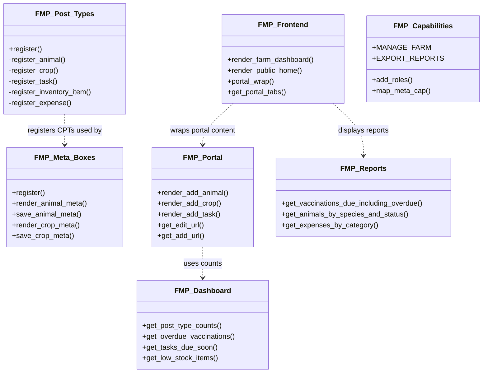
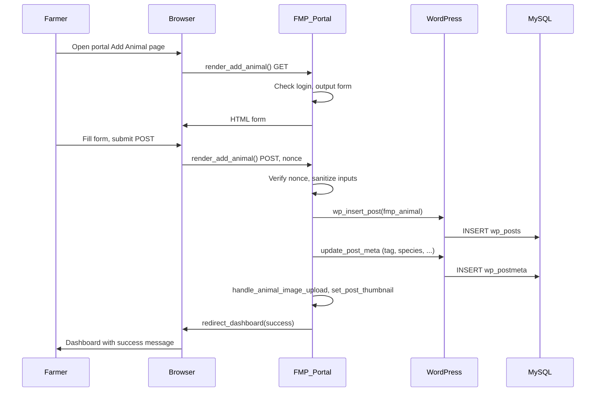
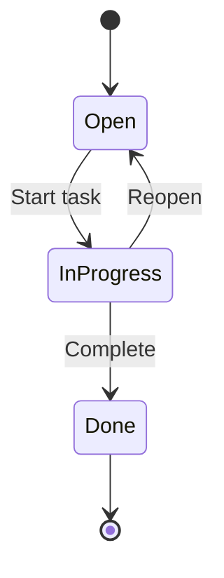
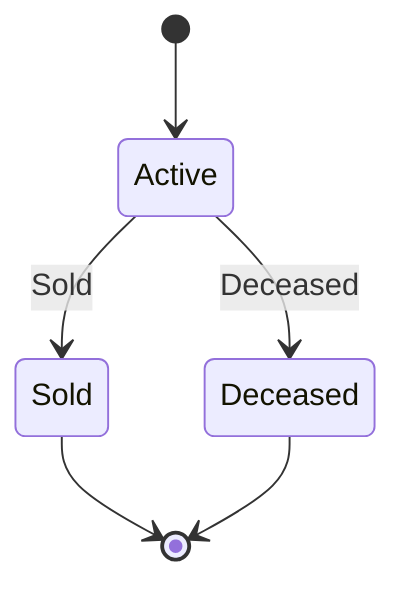
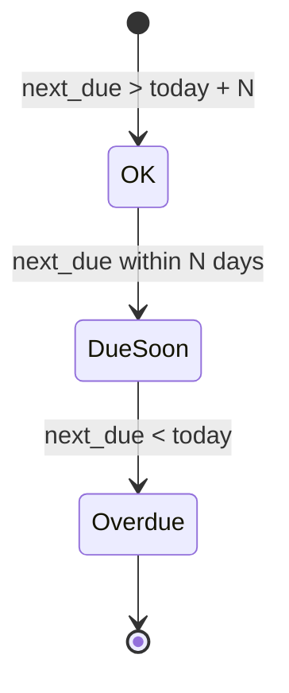
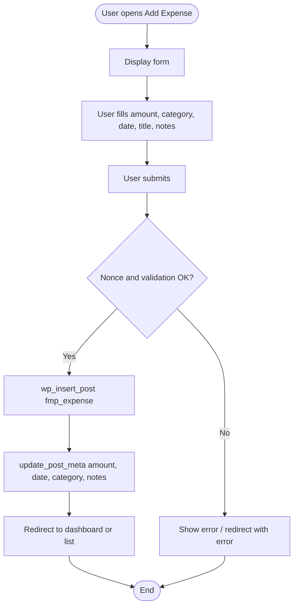
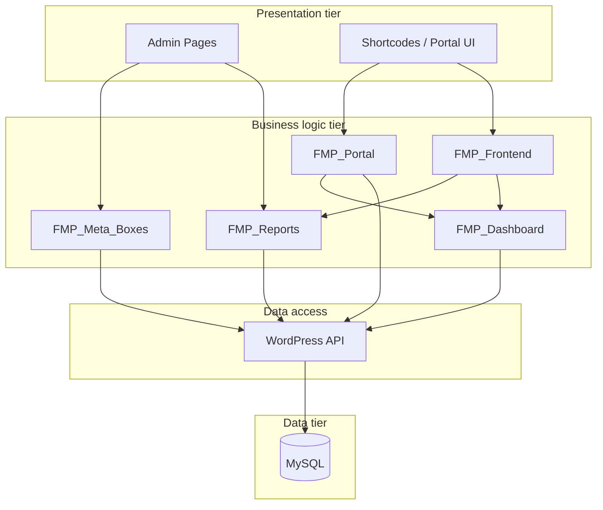
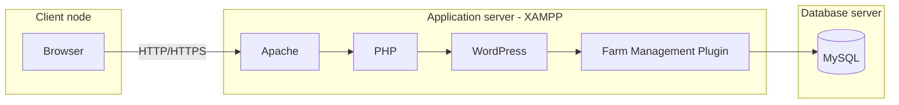

# Phase 2 – Modelling with Classes  
## Farm Management System (FMS)  
### Industry Project – 6 Month WIL

This document provides the six diagram types required by the template, with Mermaid source and short descriptions. Diagrams can be rendered in tools that support Mermaid (e.g. GitHub, VS Code with Mermaid extension) or redrawn in Draw.io/Lucidchart.

---

## 1. Class Diagram

Main plugin classes and their relationships. Entities (Animal, Crop, Task, etc.) are represented as WordPress post types with meta; the diagram shows the PHP classes that manage them.

**Caption:** Main plugin classes. FMP_Post_Types registers CPTs; FMP_Meta_Boxes and FMP_Portal handle CRUD UI and persistence; FMP_Frontend renders portal shell and dashboard; FMP_Reports and FMP_Dashboard provide report and widget data; FMP_Capabilities defines roles and permissions.

---

## 2. Sequence Diagram

Sequence for the use case “Farmer adds an animal from the portal”.

**Caption:** Add-animal flow from portal. Farmer submits form; FMP_Portal validates, creates post and meta via WordPress API, then redirects to the farm dashboard.

---

## 3. State Diagram

Entity lifecycles with clear states.

### Task lifecycle

### Animal status

### Vaccination status (derived)

**Caption:** Task has Open → In progress → Done. Animal has Active / Sold / Deceased. Vaccination display states are OK, Due soon, Overdue (derived from next due date).

---

## 4. Activity Diagram

Flow for “Record expense” (portal or admin).

**Caption:** Record expense: display form → fill → submit → validate → insert post and meta → redirect. Parallel flows exist for add animal, add crop, etc., with the same pattern.

---

## 5. Component Diagram

High-level components and dependencies.

**Caption:** Presentation (admin pages and shortcodes) depends on business logic (Portal, Frontend, Reports, Dashboard, Meta); business logic uses WordPress API only; WordPress API accesses MySQL.

---

## 6. Deployment Diagram

Nodes and artefacts.

**Artefacts:**
- **Client:** Web browser.
- **Application server:** XAMPP (Apache + PHP); WordPress core; theme; Farm Management plugin (PHP, CSS, JS in `wp-content/plugins/farm-management/`).
- **Database server:** MySQL; WordPress database (wp_posts, wp_postmeta, wp_options, etc.).

**Caption:** Client sends requests to Apache; PHP runs WordPress and the plugin; the plugin accesses MySQL via WordPress. For submission, deliver plugin .zip, database backup, and deployment manual.

---

*End of Phase 2 Modelling. All six diagram types are covered. Export or redraw as needed for the formal submission.*
